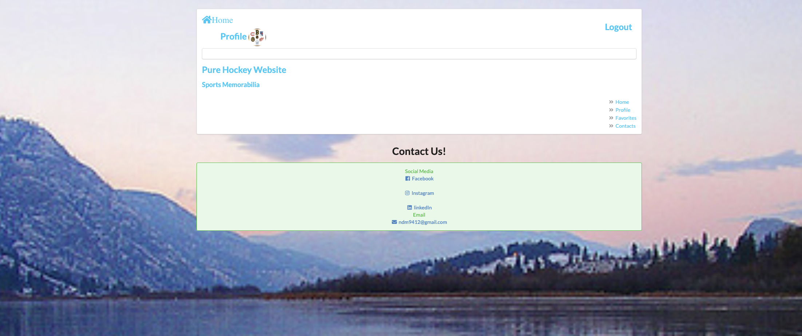

# Hat-Trick-Hub

Online web application which shares many similarities to instagram, just more specifically, for hockey fans and players. Users will have the ability to make posts, favorite posts they like, and reach out with different inquiries and questions regarding either the site or just general topics about the world of Hockey.

## Getting Started

1) Click the following link to get to the app -> https://hat-trick-hub.onrender.com/

2) Once the app is loaded in the browser new users will need to signup. Returning users will need to login, in order to access the functionality of the website. 

3) Once logged on, users will have the ability to create a post, favorite other posts, and check out other accounts that have logged on and posted

## Technologies Used 

MongoDB/Mongoose, Express, React, Node, CSS, HTML, Javascript, AWS

## Screenshots

## Trello Board

Link to trello board to see apps creation flow -> https://trello.com/b/IFmMKFD3/project-hockey

## Next Steps

I would like to add update and delete functionality to the posts users have created. Users should have the ability to make edits to the posts they have created or delete them if they wish.

I would like to implement comments into the app, making the app much more interactive between users.

I would like to add google maps API, allowing users to attach a location to a post they have made

I would like to implement a forum, where different conversation strings can be started and developed, helping the community with necessary info about the game, networking the hockey community and/or just for fun

As a User it would be nice to have the ability to update my profile picture and/or username.